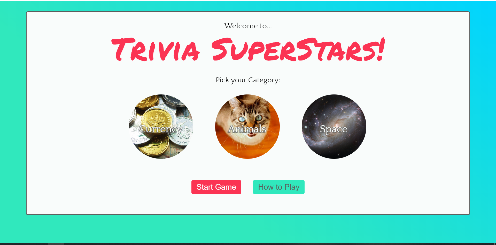
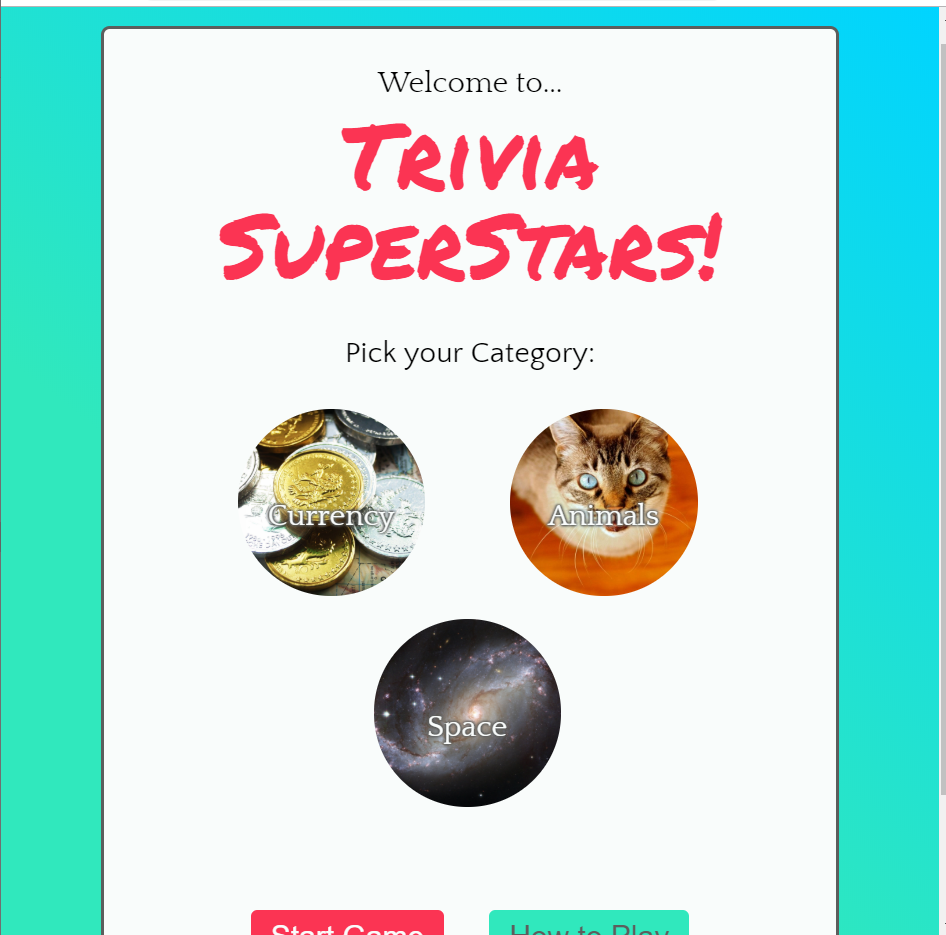
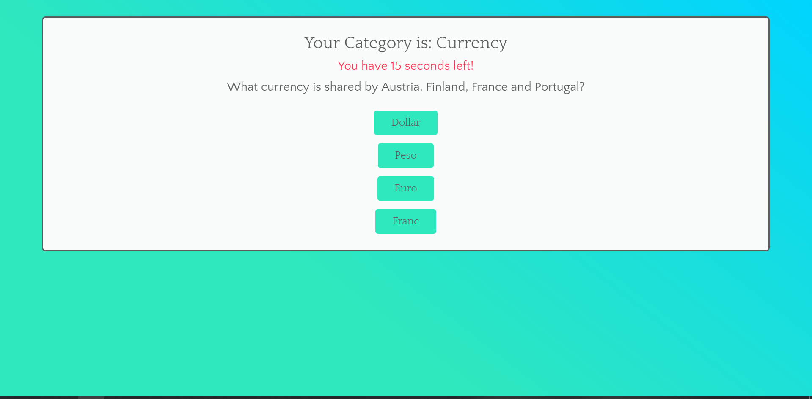
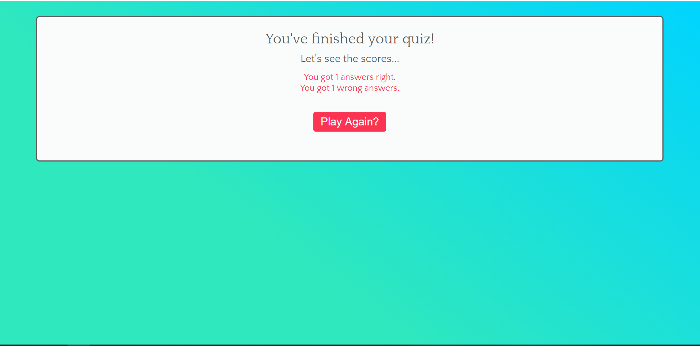

# Trivia Game - Trivia SuperStars!
A multiple category, multiple choice trivia game.

## Author
Madeleine Griggs.

## About this Project
this is trivia game, where you select a category to play, and have several timed questions to answer. When the user answers the question, the timer stops, and the correct answer is displayed, then it continues to the next question. At the end of the quiz the game displays how many questions the user got wrong and right, then they have the option to restart and play another category. It was made as part of a project for the UofT coding bootcamp. The purpose of this project was to gain an understanding of how to use function timers, and continuing to learn more jQuery.
This project was written using: HTML5, CSS3, jQuery 3.4.1, and Javascript.
You can play the game here:
[Trivia SuperStars](https://madeleinegriggs.github.io/trivia-game/)

## Information about the Theme

### Colors Used
-  `#30e8bd - Base Color: Teal color used as main background and some buttons.`
-  `#FB3453 - Accent Color: Red color used for important text, main title, and buttons.`
-  `#5c5e5d - Mid Gray: Dark grey color used for body text, and game container border.`
-  `#f9fcfb - Light White: White used for main container backgrounds, font on red buttons.`

### Fonts Used
- Font Family: 'Quattrocento Sans', sans-serif. Used for body text.
- Font Family: 'Permanent Marker', cursive. Used for the "Trivia SuperStars!" title on the title screen.
- Font Family: 'Quattrocento', serif. Used for most titles except for the main title on the title screen.

### Screenshots

#### Title Page

#### Quiz Page

#### Quiz Over Page

